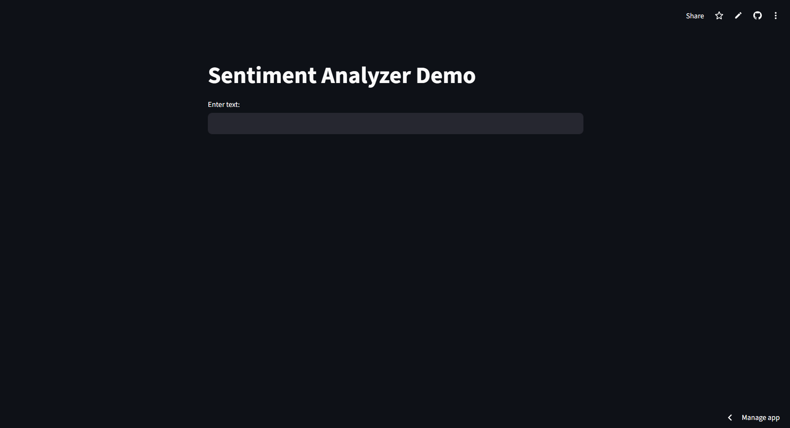
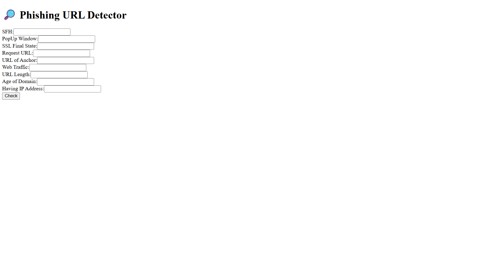

# Atul's Portfolio

Welcome to my portfolio! Here, you'll find a collection of my projects and skills.

## Projects

### 1. Password Strength Checker

A web-based password strength checker built with Python and JavaScript.

[View on GitHub](https://github.com/atuli93/Password-Strength-Checker)

### 2. Sentiment Analyzer Demo

An AI-powered sentiment analysis tool that classifies text as positive, negative, or neutral.

[View on GitHub](https://github.com/atuli93/sentiment-analyzer-demo)

### 3. BlockAssist Guide

An AI assistant that learns from user actions in Minecraft.

[View on GitHub](https://github.com/atuli93/BlockAssist-Guide)

## Contact

Email: [atul70884@gmail.com](mailto:atul70884@gmail.com)

GitHub: [github.com/atuli93](https://github.com/atuli93)

LinkedIn: [linkedin.com/in/atuli93](https://linkedin.com/in/atuli93)

© 2025 Atul — Built with ❤️ on GitHub Pages

